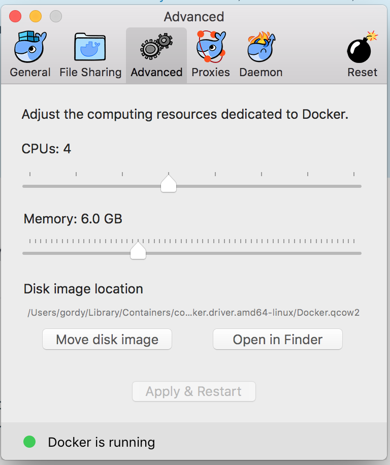

# Overview

## Docker Installation/Configuration

Three different Docker installation/configuration instructions are provided below.

1. Docker for Mac (recommended for Mac users)
2. Docker + Virtualbox (alternate Mac installation)
3. Linux (tested on Ubuntu 16.04)

### Docker for Mac

If you are running [Docker for Mac](https://www.docker.com/docker-mac), you should update
_Preferences/Advanced_ as follows:

You can install _Docker for Mac_ in two ways:

1. You can download it from [here](https://store.docker.com/editions/community/docker-ce-desktop-mac).  Get the _Stable_ version.
2. You can install it via [Homebrew Cask](https://github.com/caskroom/homebrew-cask)

#### Installing Docker for Mac via Homebrew Cask

I assume you have already installed [Homebrew](https://brew.sh/) and [Homebrew Cask](https://github.com/caskroom/homebrew-cask). If so, just do the following.

	$ brew update
	$ brew cask install docker

### Docker + Virtualbox

First step is to install [Virtualbox](https://www.virtualbox.org/wiki/VirtualBox).  I use [Homebrew Cask](https://caskroom.github.io/) for this, so installation is done as follows:

	brew cask install virtualbox virtualbox-extension-pack

Next step is to install the required Docker components.  I use [Homebrew](https://brew.sh/) for this:

	brew install docker docker-compose docker-machine

Once you have installed the prerequisites, the next step is to [Docker Machine](https://docs.docker.com/machine/overview/) to create a Docker host in Virtualbox.  This is what will actually host the containers that you run.

	docker-machine create --virtualbox-disk-size 32000 --virtualbox-memory 6144 --virtualbox-cpu-count 4 --driver virtualbox default

Then add the required environment variable to your `$HOME/.profile`.  You may see these variables by issuing the following command:

    $ docker-machine env
    export DOCKER_TLS_VERIFY="1"
    export DOCKER_HOST="tcp://192.168.99.100:2376"
    export DOCKER_CERT_PATH="/Users/gordy/.docker/machine/machines/default"
    export DOCKER_MACHINE_NAME="default"
    # Run this command to configure your shell:
    # eval $(docker-machine env)

## Linux (Ubuntu 16.04)

Add GPG key for official Docker repository.

	curl -fsSL https://download.docker.com/linux/ubuntu/gpg | sudo apt-key add -

Add the Docker repository to APT sources.

	sudo add-apt-repository "deb [arch=amd64] https://download.docker.com/linux/ubuntu $(lsb_release -cs) stable"

Next, update the package database with the Docker packages from the newly added repo:

	sudo apt-get update

Make sure you are about to install from the Docker repo instead of the default Ubuntu 16.04 repo.

	apt-cache policy docker-ce

Install Docker.

	sudo apt-get install -y docker-ce

Verify is running.

    sudo systemctl status docker
    ● docker.service - Docker Application Container Engine
       Loaded: loaded (/lib/systemd/system/docker.service; enabled; vendor preset: enabled)
       Active: active (running) since Tue 2017-08-01 14:38:48 CDT; 5s ago
         Docs: https://docs.docker.com
     Main PID: 6430 (dockerd)
       CGroup: /system.slice/docker.service
               ├─6430 /usr/bin/dockerd -H fd://
               └─6443 docker-containerd -l unix:///var/run/docker/libcontainerd/docker-containerd.sock

Add (your host) user to the docker group. This is so you do not have
to use sudo with all of the docker commands.

	sudo usermod -aG docker ${USER}

Install docker-compose.

    sudo mkdir -p /usr/local/bin
    sudo chown ${USER}:${USER} /usr/local/bin
    curl -L https://github.com/docker/compose/releases/download/1.15.0/docker-compose-`uname -s`-`uname -m` > /usr/local/bin/docker-compose
    sudo chmod +x /usr/local/bin/docker-compose

## Additional Configuration

Copy the file `DOT-env` to `.env`.  Edit the file `.env` and replace the values
assigned to `GITEMAIL` and `GITNAME` with the email address you use for GitHub
and your actual first and last name. This information is used to initialize the
`.gitconfig` file that is installed into `/opt/zimbra`. This file is in the
`.gitignore` file so you don't accidentally commit changes to it.

The other setting in that file `ROOT_PASSWORD` is for the webadmin interface
to BIND.  You can access this webadmin interface from a browser on your
host by going to `https://localhost:10000`. Log in with username `root`
and password with whatever is specified by `ROOT_PASSWORD`.

_NOTE_: If you are using [docker-machine](https://docs.docker.com/machine/get-started/) with [VirtualBox](https://www.virtualbox.org/wiki/VirtualBox), you will have to go into the _Network_ preferences for the `default` VM in _Virtualbox Manager_ and add a port forwarding rule.

The setting for `HOME_ZIMBRA` should be the path to the directory you wish
to mount into your running `zcs-dev` container at `/home/zimbra`.  The
example value shown in `DOT-env` points to the `home-zimbra` directory that
is part of this repository.  Here are a couple of examples for the `HOME_ZIMBRA` 
envitonment variable setting:

- `HOME_ZIMBRA=./home-zimbra` - This is the example value from `DOT-env`.
- `HOME_ZIMBRA=~/zimbra` - This would mount a folder called `zimbra`, located in the `$HOME` directory of your host account to `/home/zimbra` in your `zcs-dev` container.

Here are a few special directories.

### home-zimbra

This directory is mounted into the `zcs-dev` container as
`/home/zimbra` if you use the default value from `DOT-env` as the
value you put in `.env`. This follows the conventions described in the
`README` file of [zm-build](https://github.com/Zimbra/zm-build).  You
can checkout the various Zimbra git repositories that you are working
with in their and all that will be preserved when you restart the
container.

### slash-zimbra/opt-zimbra/DOT-ssh

This directory is empty (save for a `.readme` file).  If you put your
keys here before you run the container they will be copied over to 
`/opt/zimbra/.ssh`.  This directory is in the `.gitignore` file so you
don't accidentally commit ssh keys to the git repo.

## Running the system

Start by _downloading_ or _building_ the base image.

### Downloading the base image

	docker pull zimbra/zcs-dev:8.8.5alpha

### Building the base image

	./build-image

Just do a `docker-compose up -d` to start your development containers.

Once the `docker-compose up -d` command returns, the containers are running.
But the `zcs-dev` container will not be fully operational until it finishes
the run time initialization.  This takes about 1 minute. The majority of the time
required to complete the initialization is with starting the Zimbra services.

You can run this command to observe the initialization progress:

    docker logs -f zcs-dev

Once you see  this, the `zcs-dev` container will be fully operational:

    STARTUP COMPLETE

If you like, just combine the two commands:

    docker-compose up -d && docker logs -f zcs-dev

You can then connect to that container as follows:

    docker exec -it zcs-dev bash

And become the `zimbra` user as follows:

    su - zimbra

## Two containers are started

### bind

The container named `bind` is running bind DNS. This is used by the second container
that is running a single-node ZCS installation, all setup and ready do do development
with.  The directory `bind-data` is where all of the DNS configuration is stored,
so if you do make updates via the web interface, they will be saved and persisted
in that directory (which is mounted into this container at `/data`).

This container is based off the image `sameersbn/bind:9.9.5-20170626`.  You 
can read more about it [here](https://github.com/sameersbn/docker-bind).

### zcs-dev

This is the container that running the ZCS installation.

## Miscellaneous Notes

To stop your containers, just do this:

	docker_compose down

As an alternative to stopping the containers when you are not actively working
on them, you can pause them to reduce resource consumption (`docker-compose pause`)
an unpause them when you want to use them (`docker-compose unpause`).

You should edit the `/etc/hosts` file on your, um, host and add a line like this:

    127.0.0.1   zcs-dev.test

Then you can log into the web client on `zcs-dev` from a browser with the following
URL:

    https://zcs-dev.test:8443

Take a look at the `docker-compose.yml` file to see all of the port mappings.

If you need help seeing up a development environment, please take a look at [Setting up Eclipse and ItelliJ Community Edition](https://github.com/Zimbra/zm-mailbox/wiki/Setting-up-Eclipse-and-IntelliJ-IDEA-Community-Editpion).

